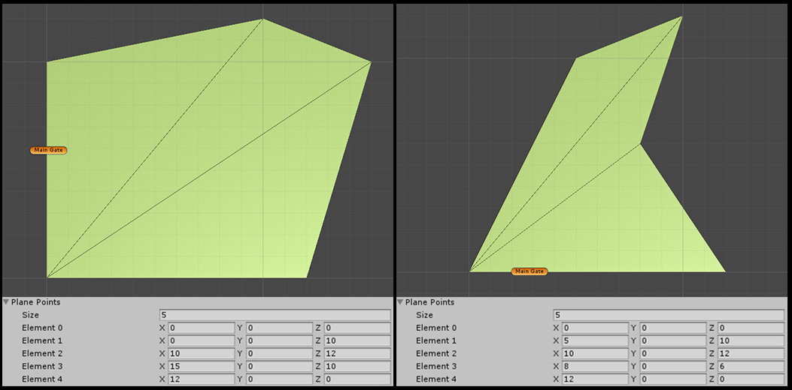
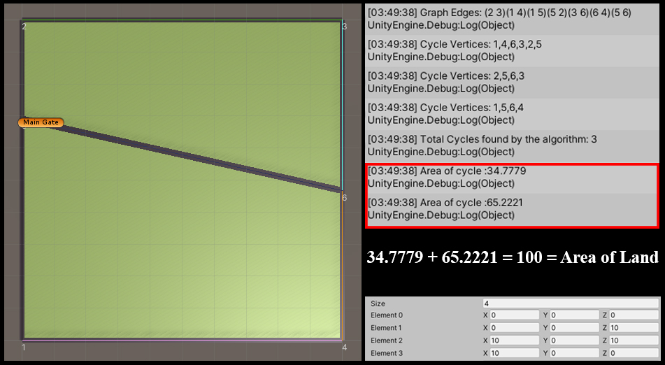
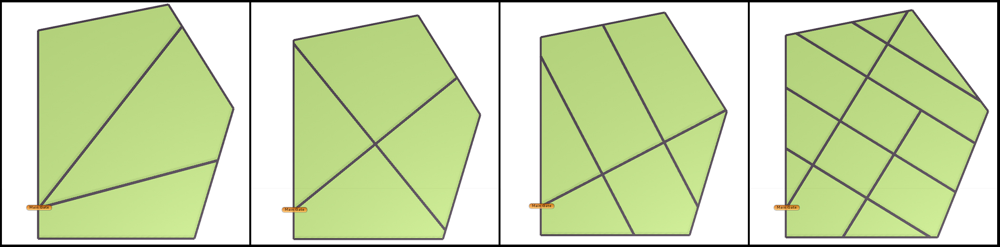

# Unity-Procedural-City-Campus-Generator
Editor script for creating different road networks in a given area defined by points in 3D space.  
Creates a 3D mesh of points provided to Plane Vertices list in inspector.(May not  always work for concave polygons) and a random road network. 
Keep clicking to get different road networks.
 
 

### A working GIF of scripts in Unity
 
 

### Ground Plane generated for given points
 
 

### Area calculation of different individual lots generated
 
 

### Different maps generated using these scripts
